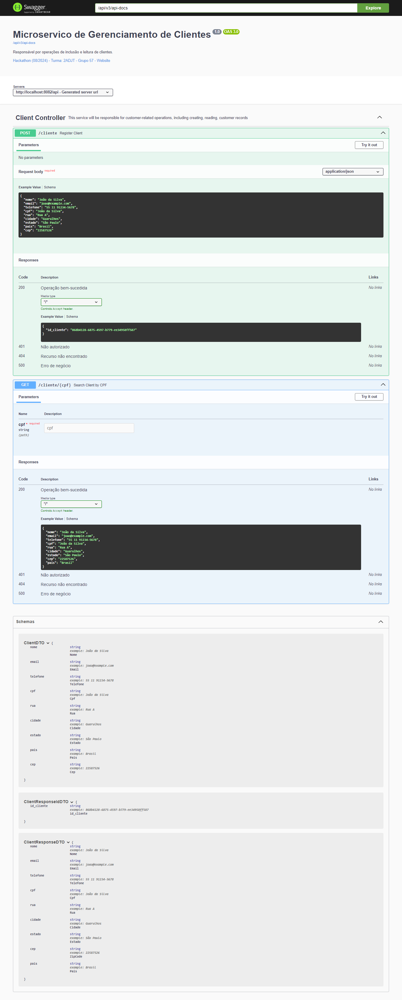

# ⭐ FIAP - Pós Tech (Hackathon) - **API de gerenciamento de clientes**

---

## 💥 Descrição
- O projeto "Gerenciamento de Cliente" foi criado como um microserviço que faz parte do "Sistema de Pagamentos de Operadoras de Cartão de Crédito". Servirá de critério de avaliação no hackathon pós tech FIAP

## 🛠️ Funcionalidades

- **Cria um novo Cliente**
    - Dado uma requisição com os valores de um novo cliente como nome e endereço o adiciona no banco de dados, e retorna sucesso

- **Busca o cadastro do cliente pelo seu cpf**
    - Dado um número de CPF retorna os dados do cliente

## 🚀 Sobre a Aplicação
- **Desenvolvida utilizando boas práticas de “Clean code”**
- **Cobertura de testes unitários**
- **Deve ser acessada por meio do MS**
    - **https://github.com/brunolimadev/fiap-hackathon-gateway-management**

## 🛠️ Repositório
- #### https://github.com/brunolimadev/fiap-hackathon-client-management

## 🚀 Tecnologias Utilizadas
- **Spring Boot:** versão 3.3.2
- **Spring Webflux:** versão 3.1.2
- **Java:** versão 17
- **Springdoc-openapi-Swagger:** versão 2.5.0
- **Lombok:**  versão 1.18.34
- **JUnit:** versão: 5.10.3

## 🛠️ Ferramentas Utilizadas
- [GitHub](https://github.com/)
- [IntelliJ IDEA](https://www.jetbrains.com/idea/)
- [Postman](https://www.postman.com/)
- [Draw.io](https://app.diagrams.net/)

## 📋 Swagger
- http://localhost:8082/api/swagger-ui/index.html#/

## 😎 Collection
- [fiap-hackaton-client-management.postman_collection.zip](https://github.com/brunolimadev/fiap-hackathon-card-management/blob/d13554927e7c9e7439b213f7d408d8d4d7ac40b5/api-test-files/fiap-hackaton-card-management.postman_collection.zip?raw=true)
    - **Obs.:** para utilizar a coleção primeiro é preciso descompactar o arquivo e importá-lo no Postman

## ⭐ Squad
- **Grupo 57**
    - Bruno Rafael de Lima da Rocha
    - Eric Leonardo Santos Rangel
    - Wiliam Nascimento da Silva
    - Lucas Aparecido da Silva Mantovani